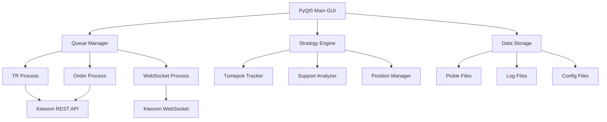
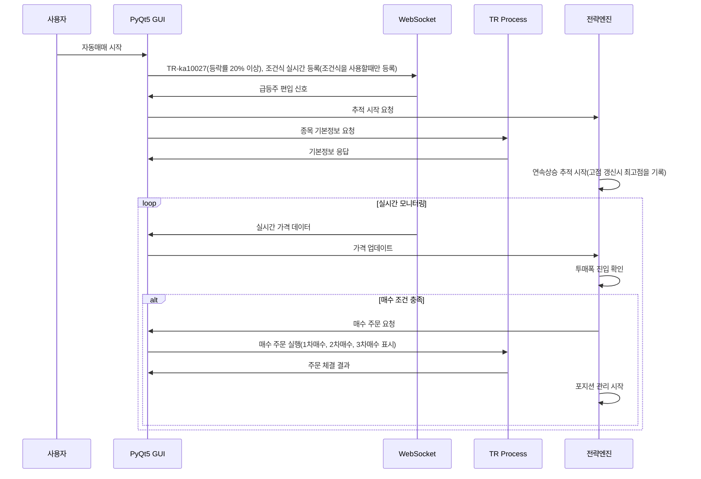
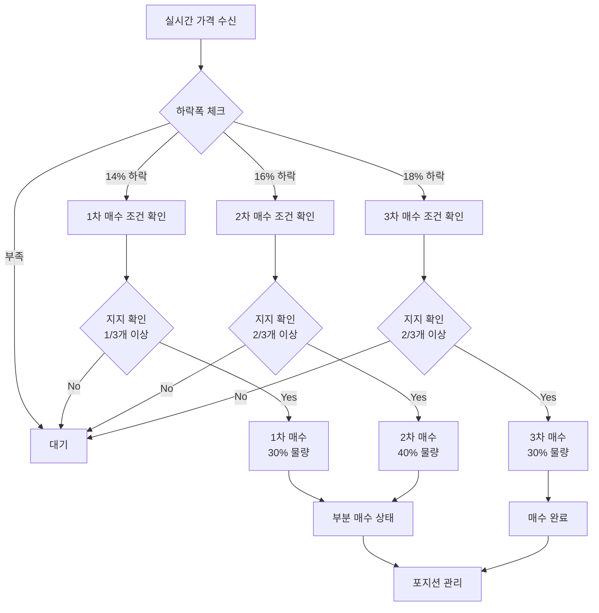

# 투매폭 자동매매 시스템 PRD
## Product Requirements Document

---

## 📋 문서 정보

| 항목 | 내용 |
|------|------|
| **문서명** | 투매폭 자동매매 시스템 PRD |
| **버전** | v1.0 |
| **작성일** | 2025.08.26 |
| **최종수정** | 2025.08.26 |
| **승인자** | 프로젝트 매니저 |
| **대상** | 개발팀, 테스트팀, 운영팀 |

---

## 🎯 제품 개요

### 제품명
**키움 REST API 기반 투매폭 자동매매 시스템**

### 제품 목적
- **투매폭 매매법**을 키움증권 REST API로 완전 자동화
- 연속상승 추적부터 단계별 분할매수, 손절/익절까지 전체 프로세스 자동 실행
- PyQt5 기반 직관적 GUI로 실시간 모니터링 및 제어 제공

### 핵심 가치 제안
1. **정확성**: 문서 기반 정밀한 투매폭 계산 및 실행
2. **안정성**: 단계별 분할매수로 리스크 최소화
3. **효율성**: 24시간 무인 자동매매 시스템
4. **투명성**: 모든 매매 과정의 실시간 로깅 및 시각화

---

## 🔗 필수 참조 문서 및 코드

### ⚠️ 중요: 개발 시 필수 분석 및 참조 사항(각 단계의 시작과 끝에 아래 참조할 가이드와 코드를 항상 분석 및 참조 할 것)

#### 1. 키움 REST API 가이드 (최우선 참조)
- **URL**: https://openapi.kiwoom.com/m/guide/apiguide
- **분석 필수 항목**:
  - TR 코드 및 엔드포인트 정확성 확인
  - 요청/응답 파라미터 정확한 매핑
  - API 호출 제한 및 정책 준수
  - WebSocket 실시간 데이터 규격 확인
  - 인증 토큰 발급 및 갱신 프로세스

#### 2. 베이스 코드 GitHub (구조 및 패턴 참조)
- **URL**: [G:\claude_project\project\basecode](G:\claude_project\project\basecode)
- **참조 필수 항목**:
  - 멀티프로세싱 Queue 통신 구조
  - TR 처리 및 WebSocket 관리 패턴
  - PyQt5 GUI 구현 방법론
  - 에러 처리 및 로깅 시스템
  - 설정 파일 관리 방식

#### 3. 투매폭 매매법 원문 (전략 로직 기준)
- **출처**: 태쏘의 데이트레이딩 바이블 2
- **핵심 참조 내용**:
  - 연속상승 추적 로직 (5일 대기 시스템(공휴일 제외))
  - 상승폭별 투매폭 매트릭스
  - 3가지 지지 확인 조건 (RSI, 지지선, 거래량)
  - 연속상승일수별 리스크 관리

### 🚨 개발팀 준수사항
1. **API 가이드 우선**: 모든 TR 및 WebSocket 구현 전 반드시 공식 가이드 확인
2. **베이스 코드 패턴 준수**: 기존 검증된 구조와 패턴 최대한 활용
3. **문서 로직 정확 구현**: 투매폭 매매법의 모든 조건과 로직 정확히 반영
4. **지속적 크로스체크**: 개발 중 지속적으로 참조 문서와 비교 검증

---

## 👥 타겟 사용자

### 1차 타겟 (Primary)
- **개인투자자 (데이트레이더)**
  - 투매폭 매매법에 관심이 있는 투자자
  - 자동매매 시스템 활용 경험자
  - 키움증권 계좌 보유자

### 2차 타겟 (Secondary)  
- **소규모 투자 그룹**
  - 체계적 매매 전략을 원하는 투자 모임
  - 백테스팅 및 전략 검증을 원하는 그룹

### 사용자 페르소나
**이름**: 김트레이더 (35세, 직장인)
- **투자경력**: 5년, 데이트레이딩 2년
- **기술수준**: 중급 (PyQt 프로그램 사용 가능)
- **투자목표**: 월 5-10% 안정적 수익
- **고민**: 감정적 매매, 타이밍 놓침, 손절 실패
- **기대**: 자동화로 감정 배제, 규칙 기반 매매

---

## 🎯 핵심 요구사항

### 1. 기능적 요구사항 (Functional Requirements)

#### 1.1 연속상승 추적 시스템
```
FR-001: 급등주 자동 감지 및 추적 시작
- 조건식 편입 시 자동으로 추적 시작
- 연속상승 일수 및 상승폭 실시간 계산
- 고점 갱신 시 투매폭 구간 자동 재계산
```

```
FR-002: 투매폭 진입 시점 자동 판단
- 상승폭별 매트릭스 기반 적정 하락폭 계산
- 3일 반등 대기 시스템 구현
- 강제 진입 조건 (3일 경과, 7일 연속상승) 처리
```

#### 1.2 단계별 매수 시스템
```
FR-003: 3단계 분할 매수 실행
- 1차 약매수: 최소 하락폭 도달 시 (30% 물량)
- 2차 보통매수: 중간 하락폭 도달 시 (40% 물량)  
- 3차 강매수: 최대 하락폭 도달 시 (30% 물량)
- 중복 매수 방지 및 단계별 이력 관리
```

```
FR-004: 지지 조건 확인
- RSI 과매도 확인 (30% 이하)
- 분봉 지지선 분석 (5분/15분봉)
- 거래량 급감 확인 (급등기간 최대 거래량의 25% 이하)
- 단계별 조건 완화 (강매수: 2/3개, 약매수: 1/3개)
```

#### 1.3 포지션 관리 시스템
```
FR-005: 매도 조건 자동 실행
- 손절: 평균단가 대비 -2% 이하
- 트레일링 스탑: +2% 도달 시 발동, 고점 대비 -1% 하락 시 매도
- 조건식 편출 시 즉시 매도
- 가중평균 매입가 기반 수익률 계산
```

#### 1.4 리스크 관리 시스템
```
FR-006: 연속상승일수별 포지션 조정
- 1-2일: 기본 포지션 (100%)
- 3일: 80% 축소
- 4일: 50% 축소  
- 5일 이상: 진입 금지
```

```
FR-007: 일일/전체 리스크 한도 관리
- 일일 최대 손실 한도 (-20만원)
- 일일 최대 거래 횟수 (20건)
- 종목당 최대 투자금액 (200만원)
- 전체 주식 투자 비율 (80%)
```

### 2. 비기능적 요구사항 (Non-Functional Requirements)

#### 2.1 성능 요구사항
```
NFR-001: 실시간 처리 성능
- 실시간 데이터 처리 지연: 100ms 이내
- TR 요청 응답시간: 1초 이내
- GUI 업데이트 주기: 1초
- 동시 추적 가능 종목 수: 20개
```

```
NFR-002: 시스템 안정성
- 시스템 가동률: 99.5% 이상 (장중 기준)
- 메모리 사용량: 500MB 이하
- CPU 사용률: 30% 이하 (평상시)
- 자동 재연결: WebSocket 끊김 시 5초 이내
```

#### 2.2 사용성 요구사항
```
NFR-003: 사용자 인터페이스
- GUI 응답성: 사용자 액션 후 0.5초 이내 반응
- 화면 해상도: 1920x1080 최적화
- 최소 해상도: 1366x768 지원
- 색상 구분: 색맹 사용자 고려한 패턴/모양 병용
```

#### 2.3 호환성 요구사항
```
NFR-004: 플랫폼 호환성
- 운영체제: Windows 10/11 (64bit)
- Python 버전: 3.8 이상 3.11 이하
- 키움증권 API: REST API 최신 버전
- 화면 DPI: 100%, 125%, 150% 지원
```

---

## 투매폭 매트릭스

### 상승폭별 적정 하락폭 테이블

| 상승폭 범위 | 최소 하락폭 | 최대 하락폭 | 예상 반등률 | 설명 |
|------------|------------|------------|------------|------|
| 20% ~ 30% | 10% | 15% | 7% | 초기 급등, 안전한 진입 |
| 31% ~ 40% | 14% | 18% | 7% | 중간 급등, 신중한 진입 |
| 41% ~ 50% | 15% | 21% | 7% | 고급등, 위험 증가 |
| 51% ~ 60% | 18% | 24% | 7% | 매우 위험한 급등 |
| 61% ~ 70% | 20% | 25% | 7% | 극도로 위험 |
| 71% ~ 80% | 21% | 24% | 7% | 투기적 상승 |
| 81% ~ 90% | 24% | 27% | 7% | 버블 의심 구간 |
| 91% ~ 100% | 25% | 28% | 7% | 극한 버블 |
| 101% 이상 | 28% | 34% | 7% | 폭등 후 대폭락 가능 |

### 매트릭스 활용 방법
```python
# 예시: 50% 상승한 종목의 경우
상승폭 = 50%
→ 매트릭스 적용: 15% ~ 21% 하락 시 진입
→ 1차 매수선: 고점에서 -15% (85% 수준)
→ 2차 매수선: 고점에서 -18% (82% 수준)  
→ 3차 매수선: 고점에서 -21% (79% 수준)
→ 목표 매도가: 매수가 대비 +7%
```

---

## 🏗️ 시스템 아키텍처

### 전체 구조


### 핵심 컴포넌트

#### 1. 메인 GUI 모듈 (PyQt5)
- **책임**: 사용자 인터페이스, 이벤트 처리, 화면 업데이트
- **주요 클래스**: `TumepokMainWindow`, `TumepokMonitoringPanel`, `TumepokChartWidget`
- **베이스 코드 참조**: GUI 구조, 타이머 관리, 테이블 모델

#### 2. TR 처리 모듈 (Process)
- **책임**: 키움 REST API 호출, 계좌/종목 정보 조회
- **주요 TR**: `kt00018`(계좌조회), `ka10007`(기본정보), `ka10081`(차트), `ka10027`(등락률)
- **베이스 코드 참조**: TR 제한 관리, 큐 통신, 에러 처리

#### 3. WebSocket 모듈 (Process)  
- **책임**: 실시간 시세, 조건검색, 주문체결 데이터 수신
- **주요 데이터**: 주식체결(`0B`), 조건검색, 주문체결(`00`)
- **베이스 코드 참조**: 연결 관리, 메시지 파싱, 재연결 로직

#### 4. 전략 엔진 모듈
- **책임**: 투매폭 로직 실행, 매수/매도 결정
- **주요 클래스**: `TumepokStrategy`, `ContinuousRiseTracker`, `SupportAnalyzer`
- **문서 참조**: 연속상승 추적, 투매폭 계산, 지지 확인

#### 5. 데이터 관리 모듈
- **책임**: 실시간 데이터 저장, 설정 관리, 로깅
- **저장 방식**: Pickle(실시간 데이터), JSON(설정), 로그 파일
- **베이스 코드 참조**: 데이터 저장 구조, 설정 파일 관리

---

## 🎨 사용자 인터페이스 설계

### 메인 윈도우 구성
```
┌─────────────────────────────────────────────────────────┐
│ [메뉴바] [자동매매 ON] [OFF] [설정저장] [시간설정]         │
├─────────────────────────────────────────────────────────┤
│ [매수설정]              │ [매도설정]                     │
│ - 조건식 선택           │ - 조건식 선택                  │ 
│ - 매수금액             │ - 손절률 설정                   │
│ - 주문방식             │ - 트레일링 설정                 │
├─────────────────────────────────────────────────────────┤
│ [탭1: 투매폭 추적] [탭2: 포지션] [탭3: 매매기록] [탭4: 분석]│
│ ┌─────────────────────────────────────────────────────┐ │
│ │ [추적 현황 테이블]                                    │ │
│ │ 종목코드│종목명│조건식│고점│1차선│2차선│3차선│매수단계  │ │
│ │ 005930 │삼성  │급등 │75000│71250│67500│63750│1차완료│ │
│ └─────────────────────────────────────────────────────┘ │
├─────────────────────────────────────────────────────────┤
│ [상태바] 연결상태 | 추적종목: 3개 | 매매완료: 1건         │
└─────────────────────────────────────────────────────────┘
```

### 주요 UI 컴포넌트

#### 1. 투매폭 추적 테이블
- **컬럼**: 종목코드, 종목명, 조건식, 시작가, 고점, 현재가, 상승률, 하락률, 1차선, 2차선, 3차선, 매수단계, 상태
- **색상 코딩**: 
  - 1차 매수선: 파란색
  - 2차 매수선: 주황색  
  - 3차 매수선: 빨간색
  - 매수 완료: 초록색 배경

#### 2. 실시간 차트
- **가격 차트**: 종가선 + 단계별 매수구간 음영 표시
- **RSI 차트**: 과매도(30) 라인 + 현재 RSI 값
- **거래량 차트**: 거래량 바 + 평균 거래량 라인

#### 3. 투매폭 매트릭스 다이얼로그
- **테이블**: 상승폭별 1차/2차/3차 매수라인 정보
- **시각화**: 분할 매수 비율 및 예상 수익률
- **백테스트**: 시뮬레이션 결과 표시

---

## 📊 데이터 모델

### 핵심 데이터 구조

#### 1. 투매폭 추적 데이터
```python
tracking_data = {
    "종목코드": {
        "stock_code": "005930",
        "종목명": "삼성전자", 
        "start_date": "20250826",
        "start_price": 70000,
        "high_price": 85000,
        "current_price": 76500,
        "rise_days": 2,
        "rise_rate": 21.4,
        "drop_rate": 10.0,
        "status": "PARTIAL_BOUGHT",
        "condition_name": "급등주포착",
        "bought_stages": {"WEAK_BUY"},
        "drop_info": {
            "min_drop": 10, "max_drop": 15, "avg_drop": 12.5
        }
    }
}
```

#### 2. 포지션 데이터
```python
position_data = {
    "종목코드": {
        "buy_price": 76000,
        "quantity": 26,
        "current_price": 78000,
        "profit_rate": 2.6,
        "trailing_activated": True,
        "trailing_high": 78500,
        "buy_stages": ["WEAK_BUY", "MODERATE_BUY"],
        "weighted_avg_price": 76200
    }
}
```

#### 3. 매매 기록 데이터
```python
trade_record = {
    "timestamp": "2025-08-26 14:30:25",
    "stock_code": "005930",
    "action": "BUY",
    "stage": "WEAK_BUY", 
    "price": 76000,
    "quantity": 13,
    "amount": 988000,
    "condition": "급등주포착",
    "rise_rate": 21.4,
    "profit_rate": 0.0
}
```

---

## 🔄 주요 프로세스 플로우

### 1. 투매폭 전체 프로세스


### 2. 단계별 매수 프로세스


---

## 🧪 테스트 계획

### 1. 단위 테스트 (Unit Test)

#### 1.1 투매폭 계산 로직
```python
def test_get_target_drop_info():
    """투매폭 정보 계산 테스트"""
    # 35% 상승 시 14-18% 하락폭 반환 확인
    
def test_check_buy_timing():
    """매수 타이밍 판단 테스트"""  
    # 각 하락률별 WEAK_BUY, MODERATE_BUY, STRONG_BUY 판단 확인
    
def test_calculate_position_size():
    """포지션 사이즈 계산 테스트"""
    # 연속상승일수별 포지션 조정 확인
```

#### 1.2 지지 분석 로직
```python
def test_rsi_calculation():
    """RSI 계산 테스트"""
    # 14일 RSI 계산 정확성 확인
    
def test_support_level_detection():
    """지지선 감지 테스트"""
    # 분봉 데이터 기반 지지선 찾기 확인
    
def test_volume_analysis():
    """거래량 분석 테스트"""  
    # 거래량 급감 판단 로직 확인
```

### 2. 통합 테스트 (Integration Test)

#### 2.1 API 연동 테스트
```python
def test_kiwoom_api_integration():
    """키움 API 연동 테스트"""
    # 토큰 발급, TR 호출, WebSocket 연결 확인
    
def test_realtime_data_flow():
    """실시간 데이터 플로우 테스트"""
    # WebSocket → GUI → Strategy 데이터 전달 확인
```

#### 2.2 전략 시나리오 테스트
```python  
def test_full_tumepok_scenario():
    """투매폭 전체 시나리오 테스트"""
    # 편입 → 추적 → 진입 → 매수 → 매도 전 과정 확인
    
def test_multi_stock_handling():
    """다종목 동시 처리 테스트"""
    # 20개 종목 동시 추적 및 매매 확인
```

### 3. 시나리오 테스트

#### 3.1 정상 시나리오
- **시나리오 1**: 조건식 편입 → 2일 연속상승 → 15% 하락 → 1차 매수 → 반등 → 익절
- **시나리오 2**: 3일 연속상승 → 18% 하락 → 3차까지 분할매수 → 트레일링 매도
- **시나리오 3**: 4일 연속상승 → 강제 진입 → 손절

#### 3.2 예외 시나리오  
- **시나리오 4**: WebSocket 연결 끊김 → 자동 재연결 → 데이터 복구
- **시나리오 5**: 상한가 종목 → 매수 불가 → 추적 해제
- **시나리오 6**: 시장 급락 → 전체 손절 → 거래 중단

### 4. 성능 테스트

#### 4.1 부하 테스트
- **동시 추적 종목**: 20개 종목 × 1초마다 가격 업데이트
- **메모리 사용량**: 8시간 연속 운영 시 메모리 누수 확인
- **CPU 사용률**: 실시간 처리 시 CPU 점유율 측정

#### 4.2 스트레스 테스트
- **대량 데이터**: 1일 1000건 이상 실시간 데이터 처리
- **장애 복구**: 프로세스 강제 종료 후 자동 복구 확인
- **장시간 운영**: 1주일 연속 운영 시 안정성 확인

---

## 📈 성과 지표 (KPI)

### 1. 기술적 지표

#### 1.1 시스템 성능
- **가동률**: 99.5% 이상 (장중 9시-15시30분 기준)
- **응답시간**: TR 요청 1초 이내, 실시간 데이터 100ms 이내  
- **처리량**: 초당 100건 이상 실시간 데이터 처리
- **에러율**: 0.1% 이하 (1000건 중 1건 이하)

#### 1.2 매매 정확성
- **신호 정확도**: 조건식 편입 후 5초 이내 추적 시작 
- **주문 성공률**: 95% 이상 (주문 접수 기준)
- **체결률**: 시장가 주문 99% 이상, 지정가 주문 80% 이상
- **데이터 정합성**: 실시간 가격과 TR 조회 가격 오차 0.1% 이내

### 2. 사용자 경험 지표

#### 2.1 사용성
- **UI 응답성**: 버튼 클릭 후 0.5초 이내 반응
- **차트 업데이트**: 1초 주기로 매끄러운 업데이트
- **알림 지연**: 매매 체결 후 5초 이내 텔레그램 알림
- **설정 저장**: 모든 설정 즉시 저장 및 복원

#### 2.2 안정성
- **크래시율**: 주당 1회 이하
- **데이터 손실**: 추적 데이터 100% 보존 (자동 저장)
- **설정 유지**: 프로그램 재시작 후 설정 100% 복원
- **로그 완성도**: 모든 매매 과정 100% 기록

### 3. 투자 성과 지표 (참고용)

#### 3.1 매매 통계
- **승률**: 목표 65% 이상 (보수적 모드 기준)
- **평균 수익률**: 거래당 +6% 이상
- **평균 손실률**: 거래당 -2% 이하  
- **Profit Factor**: 3.0 이상 (총이익/총손실)

#### 3.2 리스크 지표
- **최대 드로우다운**: -10% 이하
- **일일 최대 손실**: 설정한 한도 내 준수 (예: -20만원)
- **연속 손실 거래**: 5회 이하
- **VAR (Value at Risk)**: 일일 95% 신뢰구간에서 -5% 이하

---

## 🗓️ 개발 일정

### Phase 1: 기반 시스템 구축 (Week 1-2)
- **Week 1**: 
  - [ ] 키움 REST API 가이드 분석 및 베이스 코드 분석
  - [ ] 프로젝트 구조 설계 및 개발환경 구축
  - [ ] 멀티프로세싱 큐 통신 구조 구현
- **Week 2**:
  - [ ] 기본 TR 처리 (계좌조회, 종목정보) 구현
  - [ ] WebSocket 연결 및 실시간 데이터 수신 구현
  - [ ] PyQt5 기본 GUI 프레임워크 구축

### Phase 2: 투매폭 전략 엔진 (Week 3-5)
- **Week 3**:
  - [ ] 연속상승 추적기 구현
  - [ ] 투매폭 계산 로직 구현 (매트릭스 기반)
  - [ ] 단계별 매수 시스템 구현
- **Week 4**:
  - [ ] 지지선 분석기 구현 (RSI, 지지선, 거래량)
  - [ ] 포지션 관리자 구현 (가중평균가, 손절/익절)
  - [ ] 리스크 관리 시스템 구현
- **Week 5**:
  - [ ] 전체 전략 통합 및 플로우 구현
  - [ ] 예외 처리 및 에러 복구 로직 구현

### Phase 3: GUI 및 모니터링 (Week 6-7)
- **Week 6**:
  - [ ] 투매폭 전용 모니터링 패널 구현
  - [ ] 실시간 차트 위젯 구현 (단계별 매수선 표시)
  - [ ] 추적 현황 테이블 및 매트릭스 다이얼로그
- **Week 7**:
  - [ ] 텔레그램 알림 시스템 통합
  - [ ] 로깅 시스템 강화 및 성과 분석 기능
  - [ ] 설정 관리 및 백업/복원 기능

### Phase 4: 테스트 및 검증 (Week 8-10)
- **Week 8**:
  - [ ] 단위 테스트 작성 및 실행
  - [ ] 통합 테스트 및 시나리오 테스트
  - [ ] 모의투자 환경 구축 및 테스트
- **Week 9**:
  - [ ] 성능 테스트 및 최적화
  - [ ] 실제 시장 데이터 연동 테스트
  - [ ] 사용자 테스트 및 피드백 반영
- **Week 10**:
  - [ ] 버그 수정 및 안정화
  - [ ] 문서화 및 사용자 가이드 작성
  - [ ] 배포 준비 및 최종 검증

### Phase 5: 운영 준비 (Week 11)
- [ ] 실서버 환경 구축 및 모니터링 시스템 구축
- [ ] 자동 백업 및 복구 시스템 구축
- [ ] 운영 매뉴얼 작성 및 교육
- [ ] 정식 런칭 및 초기 운영

---

## 🎯 성공 기준

### 1. 기술적 성공 기준
- [ ] 모든 기능 요구사항 100% 구현
- [ ] 성능 지표 95% 이상 달성
- [ ] 1개월 모의투자 무장애 운영
- [ ] 코드 커버리지 80% 이상
- [ ] 베이스 코드 패턴 95% 준수

### 2. 사용자 만족도 기준  
- [ ] 사용자 테스트 만족도 4.0/5.0 이상
- [ ] GUI 직관성 평가 4.0/5.0 이상
- [ ] 매매 결과 신뢰도 4.5/5.0 이상
- [ ] 시스템 안정성 평가 4.5/5.0 이상

### 3. 투자 성과 기준 (참고)
- [ ] 3개월 모의투자 승률 60% 이상
- [ ] 월간 수익률 변동성 10% 이하  
- [ ] 최대 드로우다운 -15% 이하
- [ ] 실투자 전환율 50% 이상

---

## ⚠️ 리스크 및 대응 방안

### 1. 기술적 리스크

#### 1.1 키움 API 변경 리스크
- **리스크**: API 스펙 변경으로 기능 동작 불가
- **대응**: 
  - 공식 가이드 정기 모니터링
  - API 버전 관리 및 호환성 유지
  - 변경 사항 빠른 대응 체계 구축

#### 1.2 시스템 안정성 리스크
- **리스크**: 장시간 운영 시 메모리 누수, 프로세스 데드락
- **대응**:
  - 철저한 메모리 관리 및 리소스 해제
  - 프로세스 간 통신 타임아웃 설정
  - 자동 재시작 및 복구 메커니즘

#### 1.3 데이터 정합성 리스크
- **리스크**: 실시간 데이터와 TR 데이터 불일치
- **대응**:
  - 다중 소스 데이터 크로스체크
  - 이상 데이터 감지 및 알림
  - 수동 검증 도구 제공

### 2. 시장 리스크

#### 2.1 극단적 시장 상황
- **리스크**: 패닉장, 서킷브레이커 등 예외 상황
- **대응**:
  - 시장 지수 기반 자동 거래 중단
  - 긴급 전량 매도 기능
  - 수동 개입 인터페이스 제공

#### 2.2 투매폭 전략 한계
- **리스크**: 특정 시장 환경에서 전략 부적합
- **대응**:
  - 시장 상황별 전략 조정 기능
  - 성과 지표 실시간 모니터링
  - 전략 비활성화 임계값 설정

### 3. 운영 리스크

#### 3.1 사용자 오조작 리스크
- **리스크**: 잘못된 설정으로 인한 손실
- **대응**:
  - 설정 변경 시 확인 다이얼로그
  - 중요 설정 값 검증 로직
  - 기본값 복원 기능

#### 3.2 시스템 장애 리스크  
- **리스크**: 정전, 네트워크 장애 등
- **대응**:
  - 자동 저장 및 복구 기능
  - 모바일 알림 시스템
  - 백업 시스템 구축

---

## 📚 참조 문서

### 필수 참조 문서
1. **[키움 REST API 가이드](https://openapi.kiwoom.com/m/guide/apiguide)** ⭐⭐⭐
   - TR 코드 및 파라미터 정의
   - WebSocket 프로토콜 규격
   - 인증 및 권한 관리

2. **[베이스 코드 GitHub](https://github.com/Jaewook-github/kiwoom_rest_api/tree/main/base_code%2Fgui_base)** ⭐⭐⭐
   - 멀티프로세싱 구조 참조
   - PyQt5 GUI 패턴 참조
   - TR/WebSocket 처리 방식 참조

3. **태쏠의 데이트레이딩 바이블 2** ⭐⭐
   - 투매폭 매매법 원문
   - 연속상승 추적 로직
   - 리스크 관리 방법론

### 기술 문서
- [PyQt5 공식 문서](https://doc.qt.io/qtforpython/)
- [pandas 문서](https://pandas.pydata.org/docs/)
- [matplotlib 문서](https://matplotlib.org/stable/)
- [websockets 라이브러리 문서](https://websockets.readthedocs.io/)

### 개발 도구
- Python 3.8+ 개발 환경
- PyQt5 Designer (UI 설계)
- Git (버전 관리)
- pytest (테스트 프레임워크)

---

## 📋 체크리스트

### 개발 전 필수 확인사항
- [ ] 키움증권 계좌 개설 및 API 신청 완료
- [ ] 키움 REST API 가이드 전체 숙지
- [ ] 베이스 코드 분석 및 이해 완료  
- [ ] 투매폭 매매법 원문 숙지
- [ ] 개발환경 구축 (Python, PyQt5, 라이브러리)

### 개발 중 지속 확인사항  
- [ ] API 가이드와 실제 구현 일치성 검증
- [ ] 베이스 코드 패턴 준수 여부 점검
- [ ] 투매폭 로직 정확성 검증
- [ ] 단위 테스트 작성 및 통과
- [ ] 성능 지표 모니터링

### 배포 전 최종 확인사항
- [ ] 전체 기능 테스트 완료
- [ ] 모의투자 1개월 안정성 검증
- [ ] 사용자 가이드 작성 완료
- [ ] 백업 및 복구 시스템 테스트 완료
- [ ] 운영 모니터링 시스템 구축 완료

---

**문서 승인**
- 작성자: 개발팀장
- 검토자: 프로젝트 매니저  
- 승인자: CTO
- 승인일: 2025.08.26

*본 문서는 투매폭 자동매매 시스템 개발의 최상위 요구사항 문서입니다. 개발 과정에서 지속적으로 업데이트되며, 모든 개발자는 본 문서의 요구사항을 준수해야 합니다.*