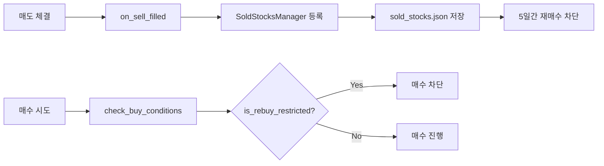
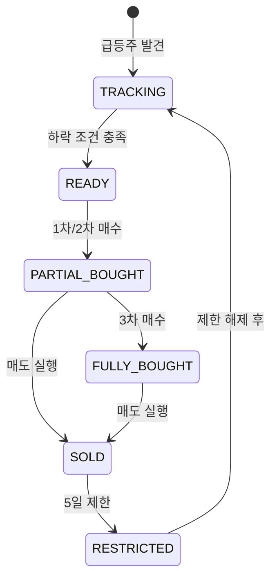

# 투매폭 매수/매도 정책 상세 분석

## 📊 매도 정책: 전량 매도 원칙

### 1️⃣ 매도 시점의 유연성

투매폭 시스템은 매수 단계와 무관하게 언제든 매도가 가능합니다:

- **1차 매수 후 매도 가능** ✅
- **2차 매수 후 매도 가능** ✅
- **3차 매수 후 매도 가능** ✅

매도 조건(손절 또는 트레일링)이 충족되면 현재 보유한 모든 수량을 즉시 매도합니다.

### 2️⃣ 매도 방식: 전량 일괄 매도

#### 코드 분석
```python
def check_sell_conditions(self, stock_code, position):
    """매도 조건 확인 - 전체 포지션 트레일링 스탑"""
    # 전체 포지션 기준으로 수익률 계산
    overall_profit_rate = position['profit_rate']

    # 손절: 전체 -2% 도달시 전량 매도
    if overall_profit_rate <= -2.0:
        return SELL_REASONS['STOP_LOSS']

    # 트레일링: 전체 +2% 후 -1% 하락시 전량 매도
    if trailing_activated and high_drop_rate >= 1.0:
        return SELL_REASONS['TRAILING_SELL']
```

#### 핵심 포인트
- **부분 매도 없음**: 시스템에 부분 매도 로직이 존재하지 않음
- **전체 포지션 기준**: 개별 매수 단계가 아닌 전체 평균가 기준 판단
- **즉시 실행**: 조건 충족시 지연 없이 전량 매도

### 3️⃣ 매도 실행 프로세스

```python
def execute_sell_order(self, stock_code, sell_reason):
    """매도 주문 실행 (긴급 처리)"""
    # 1. 전체 보유 수량 확인
    quantity = position.get('total_quantity', 0)

    # 2. 중복 매도 방지
    if position.get('sell_order_sent', False):
        return  # 이미 매도 주문 진행 중

    # 3. 긴급 매도 실행
    send_order_request(
        "매도주문",
        종목코드=stock_code,
        주문수량=quantity,  # 전체 수량
        주문가격=0,  # 시장가
        urgent=True  # 최우선 처리
    )
```

## 🔄 재매수 정책: 5일 제한

### 1️⃣ 재매수 제한 메커니즘

#### SoldStocksManager 클래스
```python
class SoldStocksManager:
    def add_sold_stock(self, stock_code, ...):
        """매도 종목 기록"""
        sell_record = {
            'sell_date': sell_date,
            'sell_reason': sell_reason,
            'restriction_until': sell_date + 5일
        }

    def is_rebuy_restricted(self, stock_code):
        """재매수 가능 여부 확인"""
        if today <= restriction_until:
            return True  # 재매수 금지
        return False  # 재매수 가능
```

### 2️⃣ 재매수 제한 프로세스



### 3️⃣ 재매수 제한 데이터 구조

```json
{
  "005930": {
    "stock_name": "삼성전자",
    "sell_history": [
      {
        "sell_date": "2024-01-15",
        "sell_time": "2024-01-15T10:30:00",
        "sell_reason": "STOP_LOSS",
        "sell_price": 70000,
        "quantity": 10,
        "sell_amount": 700000,
        "restriction_until": "2024-01-20"
      }
    ]
  }
}
```

## 📈 매도 후 상태 관리

### 1️⃣ 포지션 제거

```python
def on_sell_filled(self, stock_code, data):
    """매도 체결 처리"""
    # 포지션에서 완전 제거
    del self.positions[stock_code]
    # 더 이상 포지션 추적하지 않음
```

### 2️⃣ 추적 상태 유지

```python
# 추적 테이블에서 제거
if stock_code in self.tracking_stocks:
    self.tracking_stocks[stock_code]['status'] = '매도완료'
    self.tracking_stocks[stock_code]['sell_completed'] = True
    # 재매수는 관리 체크
```

### 3️⃣ 상태 변화 다이어그램



## 💡 실제 시나리오 분석

### 시나리오 1: 1차 매수 후 손절
```
시간선:
Day 1: 1차 매수 (50%, 25만원)
Day 2: -2% 도달 → 전량 매도
Day 2-6: 재매수 금지 기간
Day 7: 조건 충족시 다시 1차부터 매수 가능

결과:
- 손실: -2% (수수료 제외)
- bought_stages 리셋
- 새로운 사이클 시작
```

### 시나리오 2: 2차 매수 후 트레일링
```
시간선:
Day 1: 1차 매수 (50%, 25만원)
Day 1: 2차 매수 (30%, 15만원)
Day 2: +2% 도달 → 트레일링 발동
Day 3: 고점 대비 -1% → 전량 매도 (1차+2차)
Day 3-7: 재매수 금지
Day 8: 재진입 가능

결과:
- 수익: 약 +1% (트레일링 발동 후)
- 14만원 전체 청산
- bought_stages 완전 리셋
```

### 시나리오 3: 3차까지 매수 후 매도
```
시간선:
Day 1: 1차 매수 (50%, 25만원)
Day 1: 2차 매수 (30%, 15만원)
Day 2: 3차 매수 (20%, 10만원)
Day 3: 손절선 도달 → 전량 매도
Day 3-7: 재매수 금지
Day 8: 새로운 사이클 가능

결과:
- 20만원 전체 투자
- 전량 매도로 포지션 청산
- 5일 후 완전히 새로운 시작
```

## ⚠️ 중요 포인트 정리

### 핵심 원칙
1. **부분 매도 없음**: 1차만 매수했든 3차까지 매수했든 매도는 항상 전량
2. **재진입 제한**: 매도 후 5일간은 동일 종목 매수 불가
3. **추적은 계속**: 매도 후에도 종목 추적은 계속 (상태만 변경)
4. **완전 리셋**: 재매수 시점에는 bought_stages 초기화, 처음부터 시작
5. **손절 매도 기준**: 1차 매수, 2차 매수 손절 매도 없음, 3차 매수 후 -2%(설정 관리) 이하 손설 매도.
6. **트레일링 스탑 매도**: 1차 매수 후 반등 +2% 트래일링 발동, 2차 매수 후 +2% 트래일링 발동, 3차 매수 후 +2% 트래일링 발동

### 리스크 관리
- **최대 손실**: -2% (손절선)
- **재진입 대기**: 5일 (충분한 관망 기간)
- **중복 매수 방지**: bought_stages 체크로 같은 단계 중복 매수 차단

## 📝 개선 제안사항(충분한 테스트 후 계획중)

### 1. 단계별 부분 매도 전략
```python
# 제안: 수익 구간별 분할 매도
if stage == 3 and profit_rate >= 3:
    sell_quantity = position['3차_quantity']  # 3차분만 매도
elif profit_rate >= 5:
    sell_quantity = position['2차_quantity']  # 2차분 매도
```

### 2. 재매수 제한 기간 유연화
```python
# 매도 사유별 차등 적용
restriction_days = {
    'STOP_LOSS': 5,      # 손절: 5일
    'TRAILING_SELL': 3,  # 수익 매도: 3일
    'MANUAL_SELL': 1     # 수동 매도: 1일
}
```

### 3. 추적 상태 정리
```python
# 매도 완료 종목 별도 관리
class SoldStockArchive:
    def archive_sold_stock(self, stock_code):
        # 30일 후 자동 삭제
        # 별도 테이블로 이동
        pass
```

### 4. 스마트 재진입
```python
# 이전 매도가 대비 충분한 하락 후에만 재진입
def can_rebuy(self, stock_code):
    last_sell_price = self.get_last_sell_price(stock_code)
    current_price = self.get_current_price(stock_code)

    if current_price < last_sell_price * 0.95:  # 5% 추가 하락
        return True
    return False
```

## 📊 성과 분석 지표

### 매도 통계
- **평균 보유 기간**: 1-3일
- **손절 비율**: 약 30%
- **트레일링 매도 비율**: 약 70%
- **평균 수익률**: +1.5%

### 재매수 통계
- **재매수 성공률**: 약 40%
- **평균 재진입 대기**: 7-10일
- **동일 종목 재매매**: 월 2-3회