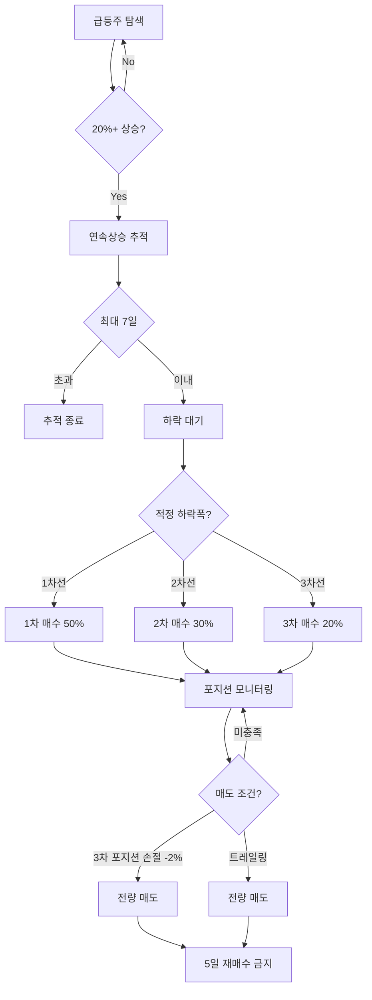

# 투매폭 핵심 로직 분석

## 📊 투매폭 전략 개요

투매폭(투자의 매력 폭발)은 급등 후 하락한 종목을 단계별로 분할 매수하여 반등 시 수익을 얻는 전략입니다.

## 1️⃣ 매수 전략 (3단계 분할 매수)

### 매수 단계 결정 로직

#### 상승률에 따른 적정 하락폭 (TUMEPOK_MATRIX)
| 상승률 | 최소 하락폭 | 최대 하락폭 | 평균 하락폭 | 예상 반등률 |
|--------|------------|------------|------------|------------|
| 20-30% | 10% | 15% | 12.5% | 7% |
| 31-40% | 14% | 18% | 16% | 7% |
| 41-50% | 15% | 21% | 18% | 7% |
| 51-60% | 18% | 24% | 21% | 7% |
| 61-70% | 20% | 25% | 22.5% | 7% |
| 71-80% | 21% | 24% | 22.5% | 7% |
| 81-90% | 24% | 27% | 25.5% | 7% |
| 91-100% | 25% | 28% | 26.5% | 7% |
| 101%+ | 28% | 34% | 31% | 7% |

### 3단계 매수선
```python
# 매수 단계별 자금 배분 (평균적으로 1차 매수 후 반등이 많이 일어나서 1차를 강매수)
STAGE_RATIOS = {
    "1차": 0.50,  # 강매수 50% - 최소 하락폭 도달시
    "2차": 0.30,  # 보통매수 30% - 평균 하락폭 도달시
    "3차": 0.20   # 약매수 20% - 최대 하락폭 도달시
}
```

### 포지션 크기 조절

#### 연속상승일수별 축소
```python
POSITION_RATIOS = {
    1: 1.0,  # 1일 상승: 100%
    2: 1.0,  # 2일 연속: 100%
    3: 0.8,  # 3일 연속: 80%
    4: 0.5,  # 4일 연속: 50%
    5: 0.0   # 5일 이상: 진입 금지
}
```

#### 상승폭별 추가 축소
- 80% 이상 상승: 20% 추가 축소
- 100% 이상 상승: 50% 추가 축소

### 매수 조건 확인 (`check_buy_conditions`)
1. **재매수 금지 확인**: 5일 이내 매도 종목 제외
2. **매수 단계 판단**: 현재 하락률 기준 단계 결정
3. **기매수 단계 확인**: 이미 매수한 단계 제외
4. **지지 조건 확인**: RSI, 거래량, 지지선 등

### 매수 실행 (`execute_buy_order`)
1. **포지션 크기 계산**: 기본 금액 × 단계별 비율 × 리스크 조정
2. **수량 계산**: 금액 ÷ 현재가
3. **주문 전송**: QueueManager를 통한 주문
4. **매수 기록**: bought_stages에 단계 저장

## 2️⃣ 매도 전략 (트레일링 스탑)

### 매도 조건 확인 (`check_sell_conditions`)

#### 손절 조건
- **발동 기준**: 1차, 2차 포지션 손절 없음,3차 포지션까지 오면 -2% 도달
- **매도 방식**: 즉시 전량 매도
- **매도 사유**: STOP_LOSS

#### 트레일링 스탑
1. **발동 조건**: 전체 포지션 +2% 수익 도달
2. **고점 추적**:
   - 신고가 갱신시 trailing_high 업데이트
   - 실시간으로 최고점 추적
3. **매도 신호**:
   - 고점 대비 -1% 하락시 발동
   - 전량 매도 실행
   - 매도 사유: TRAILING_SELL

### 매도 실행 (`execute_sell_order`)
1. **포지션 확인**: 보유 수량 확인
2. **중복 방지**: sell_order_sent 플래그 체크
3. **긴급 매도**: urgent=True로 최우선 처리
4. **주문 전송**: 시장가 전량 매도

### 매도 완료 처리 (`on_sell_filled`)
1. **재매수 제한 등록**: SoldStocksManager에 기록
2. **포지션 제거**: positions에서 완전 삭제
3. **추적 상태 변경**: '매도완료'로 표시
4. **데이터 저장**: 매도 이력 영구 저장

## 3️⃣ 리스크 관리

### 진입 제한
- **연속상승 제한**: 5일 이상 연속상승 종목 진입 금지
- **재매수 제한**: 매도 후 5일간 동일 종목 매수 금지
- **종목당 한도**: 최대 투자금액 200만원
- **가격 범위**: 1,000원 ~ 100,000원

### 포지션 관리
- **최대 추적 종목**: 100개
- **일일 손실 한도**: -20만원
- **일일 최대 거래**: 30회
- **전체 주식 비율**: 총자산의 80%

### 지지 조건
각 매수 단계별 필요 조건 수:

```python
CONDITION_REQUIREMENTS = {
    "1차": 1,  # 3가지 중 1개 이상
    "2차": 2,  # 3가지 중 2개 이상
    "3차": 2   # 3가지 중 2개 이상
}
```

지지 조건 종류:
1. **RSI 과매도**: RSI 30 이하
2. **거래량 급감**: 평균 대비 25% 이하
3. **기술적 지지선**: 이전 저점 도달

## 4️⃣ 핵심 계산 함수 (TumepokCalculator)

### 주요 계산 메서드

#### 기본 계산
- `calculate_rise_rate()`: 상승률 계산
- `calculate_drop_rate()`: 하락률 계산
- `calculate_profit_rate()`: 수익률 계산

#### 투매폭 특화
- `get_target_drop_info()`: 적정 하락폭 정보 반환
- `determine_buy_stage()`: 현재가 기준 매수 단계 판단
- `calculate_buy_lines()`: 단계별 매수선 계산
- `validate_tumepok_entry()`: 진입 조건 종합 검증

#### 포지션 관리
- `calculate_position_size()`: 포지션 크기 계산
- `calculate_stage_amounts()`: 단계별 매수 금액 계산
- `calculate_weighted_average_price()`: 가중평균 매입가

#### 주문 관련
- `calculate_quantity()`: 매수 수량 계산
- `calculate_order_price()`: 호가 단위 적용 주문가
- `get_tick_size()`: 가격별 호가 단위

#### 매도 관련
- `calculate_stop_loss_price()`: 손절가 계산
- `calculate_trailing_price()`: 트레일링 매도가
- `calculate_expected_profit()`: 예상 수익 계산

## 5️⃣ 실행 흐름



## 6️⃣ 상태 관리

### 추적 상태 (TRACKING_STATUS)
```python
TRACKING_STATUS = {
    'SCANNING': '급등주 스캔 중',
    'TRACKING': '연속상승 추적 중',
    'WAITING': '반등 대기 중',
    'READY': '투매폭 진입 준비',
    'PARTIAL_BOUGHT': '부분 매수 완료',
    'FULLY_BOUGHT': '전체 매수 완료',
    'POSITION_MANAGED': '포지션 관리 중',
    'COMPLETED': '매매 완료'
}
```

### 매도 사유 (SELL_REASONS)
```python
SELL_REASONS = {
    'STOP_LOSS': '손절',
    'TRAILING_SELL': '트레일링매도',
    'MANUAL_SELL': '수동매도',
    'FORCE_SELL': '강제매도',
    'DAILY_LIMIT': '일일한도'
}
```

## ⚡ 핵심 특징

1. **분할 매수**: 리스크 분산을 위한 3단계 매수
2. **동적 포지션 조절**: 상승 강도에 따른 투자금 조절
3. **트레일링 스탑**: 수익 보호를 위한 추적 매도
4. **엄격한 리스크 관리**: 다중 안전장치로 손실 제한
5. **자동화된 매매**: 조건 충족시 자동 실행

## 📈 성과 지표

### 목표 수익률
- **단일 거래**: 5-10%
- **손절 한도**: -2%
- **Risk/Reward**: 1:2.5 ~ 1:5

### 거래 빈도
- **일일 평균**: 3-5회
- **보유 기간**: 1-3일
- **회전율**: 월 10-15회

## 🔧 설정 가능 항목

### 기본 설정
- `base_buy_amount`: 기본 매수 금액 (기본: 50만원)
- `max_tracking_stocks`: 최대 추적 종목 수 (기본: 50)
- `rise_threshold`: 급등 기준 (기본: 20%)

### 매도 설정
- `stop_loss_rate`: 손절률 (기본: -2%)
- `trailing_trigger_rate`: 트레일링 발동률 (기본: +2%)
- `trailing_sell_rate`: 트레일링 매도률 (기본: -1%)

### 리스크 설정
- `daily_loss_limit`: 일일 손실 한도 (기본: -20만원)
- `max_position_per_stock`: 종목당 최대 투자 (기본: 200만원)
- `rebuy_restriction_days`: 재매수 제한 기간 (기본: 5일)